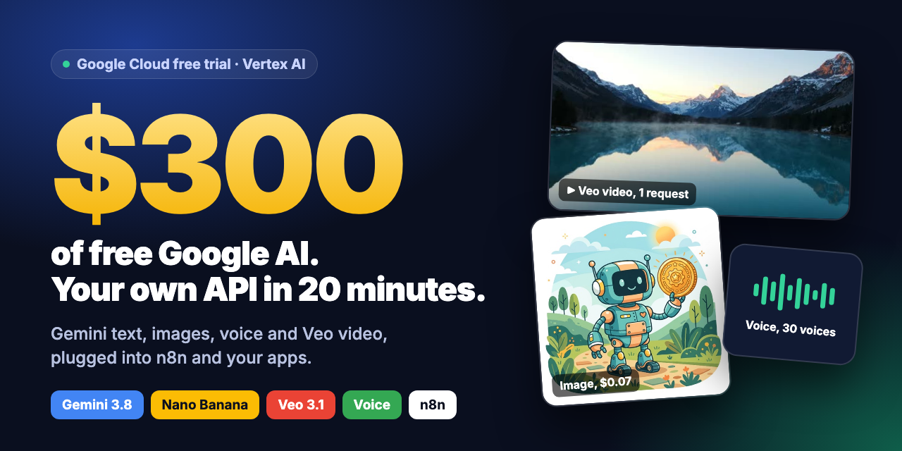
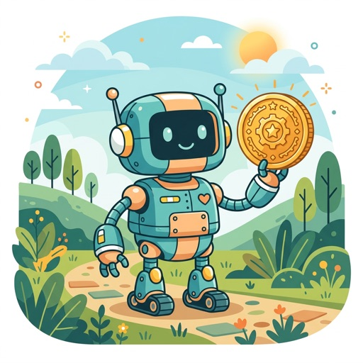

# google-300-free-ai-credits

### Google gives you $300 of free AI. Most people never use it.

[](https://github.com/Iliesseu28/google-300-free-ai-credits/actions/workflows/tests.yml)


[](LICENSE)

<p align="center"><a href="docs/assets/promo.mp4"></a><br><a href="docs/assets/promo.mp4"><b>▶ Watch the 30-second video</b></a></p>

Every new Google Cloud account gets **$300 of credit for 90 days**. That credit pays for Google's best AI
models on **Vertex AI**: Gemini 3.8, Nano Banana images, Veo 3.1 video with sound, natural voices.

Most people never touch it, because the path from "free credit" to "an API my tools can call" is
buried in cloud jargon. This repo is that path, tested end to end:

1. **Claim the credit** (5 min, a card is required, nothing is charged during the trial, valid **90 days**.
   Heads-up: some accounts are asked for a ~$10 prepayment, [details](docs/01-free-trial.md#sign-up))
2. **Set up Vertex AI** (10 min, clicks or 5 commands)
3. **Run a tiny proxy** that turns your Google project into one simple API
4. **Plug it into n8n, your apps, any OpenAI-compatible tool**

We run this in production to power a few dozen n8n workflows and several apps.

## Make an AI do it for you

Open Claude Code, Cursor, Codex or any coding agent and paste:

```text
Clone https://github.com/Iliesseu28/google-300-free-ai-credits and follow
skills/google-free-credits/SKILL.md to set me up, step by step.
```

The agent guides you through the sign-up, creates the project and the service account, starts the proxy,
connects n8n or your app, and checks every step. You only click where a human has to (sign-up and card).

Claude Code plugin:

```text
/plugin marketplace add Iliesseu28/google-300-free-ai-credits
/plugin install google-free-credits@google-300-free-ai-credits
```

Then say *"set me up with the Google free credits"*.

## What you get

| | Model | $300 buys about | Sample |
|---|---|---|---|
| **Text** | Gemini 3.8 Flash, 3.1 Pro | 100,000+ n8n AI steps | `"Hello there, friend!"` |
| **Images** | Nano Banana 2, Imagen 4 | 4,400 to 15,000 images |  |
| **Voice** | Gemini TTS, 30 voices, any language | 300+ hours of speech | [voice-sample.mp3](docs/assets/voice-sample.mp3) |
| **Video + sound** | Veo 3.1 Lite, Fast, Standard | 12 to 100 minutes of video |  |

Every sample above was generated through this proxy with one request. Full price list:
[what $300 buys](docs/07-models-and-prices.md).

## What people build with it

- **n8n automations**: AI Agents, summaries, email triage, lead scoring, running on Gemini instead of paid API keys
- **Content machines**: a topic in, a caption + image + voice-over + short video out, every day
- **Apps**: an AI feature in your mobile or web app, called from your backend
- **Any OpenAI tool**: Open WebUI, LangChain, Continue, scripts. Change the base URL, keep your code

## The proxy in 30 seconds

```
 n8n / your app / any OpenAI SDK
        │  X-API-Key: your proxy key
        ▼
   vertex-proxy  (one Python file, Docker or Cloud Run)
        │  service account, Vertex AI User role only
        ▼
   Vertex AI: Gemini · Nano Banana · Imagen · Gemini TTS · Veo   ──►  paid by your $300 credit
```

| Route | What it does |
|---|---|
| `POST /v1/chat/completions` | OpenAI-compatible chat with Gemini (streaming works) |
| `POST /v1/gemini/<model>` | Raw Gemini: JSON schemas, tools, image input |
| `POST /v1/image` | Prompt in, PNG out |
| `POST /v1/tts` | Text in, WAV out |
| `POST /v1/video` + `/v1/video/status` | Prompt (or image) in, MP4 with sound out |

Why a proxy and not just a key? Vertex AI has no simple API key: it wants Google service-account auth,
the right region per model, long-running operations for video, and retries on quota errors. The proxy
does all of that once, and your tools only see a clean API with keys you control and can revoke.

```bash
cp .env.example .env        # your project id + a proxy key
docker compose up -d --build
KEY=<your-proxy-key>
curl localhost:8080/v1/chat/completions -H "Authorization: Bearer $KEY" -H "Content-Type: application/json" \
  -d '{"model":"gemini-3.8-flash","messages":[{"role":"user","content":"Hi!"}]}'
```

## The guide

| Step | |
|---|---|
| 1 | [Claim the $300 free trial](docs/01-free-trial.md) |
| 2 | [Set up Vertex AI and a service account](docs/02-google-cloud-setup.md) |
| 3 | [Run the proxy](docs/03-run-the-proxy.md): your computer, Docker next to n8n, or Cloud Run |
| 4 | [Use it from anything](docs/04-use-it.md): OpenAI SDK, curl, Python, Node |
| 5 | [Connect n8n](docs/05-n8n.md), with a [ready-made workflow](n8n/content-pipeline.json) |
| 6 | [Video with Veo](docs/06-video-with-veo.md) |
| | [What $300 buys](docs/07-models-and-prices.md) · [Troubleshooting](docs/08-troubleshooting.md) · [When the credit runs out](docs/09-when-credits-run-out.md) |

## Good to know

- **The credit does not pay for Google AI Studio API keys.** Only Vertex AI. That's the whole point of this repo.
- **No surprise bill.** During the trial Google never charges your card, and when it ends, calls simply stop.
  You only start paying if you click **Activate full account** yourself. See [when the credit runs out](docs/09-when-credits-run-out.md).
- **New customers only**, once per person. Upgrading to a paid account later keeps what's left of the credit
  until day 90.
- Prices and model names checked on **September 24, 2026**. Google changes them: the docs link to the
  official pages.

Not affiliated with Google. Google Cloud, Vertex AI, Gemini and Veo are trademarks of Google LLC.

## License

MIT
